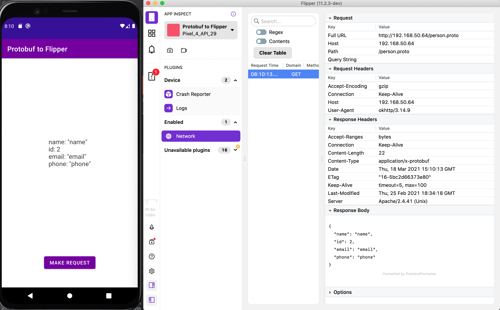

# Extract ProtobufJS Messages from Generated Java Classeses


Takes the Java classes generated from Protobuf 3 messages and return a Map suitable for JSON serialization and use in [ProtobufJS](https://github.com/protobufjs/protobuf.js)

The included demo app shows how this is used for decoding protobuf data in the Flipper network inspection tool:



## Download

Install in your build.gradle:

```
dependencies {
  implementation 'com.github.hbmartin:protobuf_java_to_protobufjs:0.0.1'
}
```


## Usage

This library exposes a single call, which accept a `GeneratedMessageV3` subclass and returns a nested Map:

```
    ProtobufGeneratedJavaToProtobufJs(Person::class.java)
```

Also provided is a Kotlin extension method that is equivalent to the above:

```
    Person::class.java.toMessages()
```


## License

MIT License

Copyright (c) Harold Martin

Permission is hereby granted, free of charge, to any person obtaining a copy
of this software and associated documentation files (the "Software"), to deal
in the Software without restriction, including without limitation the rights
to use, copy, modify, merge, publish, distribute, sublicense, and/or sell
copies of the Software, and to permit persons to whom the Software is
furnished to do so, subject to the following conditions:

The above copyright notice and this permission notice shall be included in all
copies or substantial portions of the Software.

THE SOFTWARE IS PROVIDED "AS IS", WITHOUT WARRANTY OF ANY KIND, EXPRESS OR
IMPLIED, INCLUDING BUT NOT LIMITED TO THE WARRANTIES OF MERCHANTABILITY,
FITNESS FOR A PARTICULAR PURPOSE AND NONINFRINGEMENT. IN NO EVENT SHALL THE
AUTHORS OR COPYRIGHT HOLDERS BE LIABLE FOR ANY CLAIM, DAMAGES OR OTHER
LIABILITY, WHETHER IN AN ACTION OF CONTRACT, TORT OR OTHERWISE, ARISING FROM,
OUT OF OR IN CONNECTION WITH THE SOFTWARE OR THE USE OR OTHER DEALINGS IN THE
SOFTWARE.
